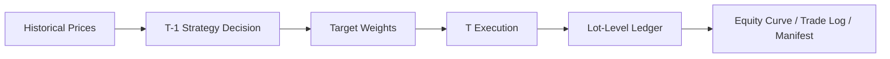

# Quant Open-Source Edition

Public-safe version of a stricter backtesting framework, focused on execution discipline instead of private alpha logic.

## What This Repo Solves

This repository keeps the parts that are suitable for open source:

- T-1 decision / T execution discipline
- past-only data slicing to avoid lookahead leakage
- lot-level position bookkeeping
- T+1 confirmation / sellable constraints
- buy fee / sell fee / slippage modeling
- exportable backtest artifacts

It intentionally does **not** include:

- private strategy rules
- live trading controller logic
- notification pipelines
- real fund universes or OTC mapping details
- API keys, email credentials, or data-provider secrets

## Why It Exists

Many quant projects can show a backtest curve, but fewer can clearly explain why the backtest is trustworthy.

This public edition focuses on the part that is worth sharing:

- how to separate decision date from execution date
- how to avoid future leakage in feature usage
- how to track holdings at lot level instead of only weight snapshots
- how to model settlement and transaction frictions explicitly

## Repository Structure

```text
quant_open_source/
├─ strict_backtester.py
├─ ledger.py
├─ interfaces.py
├─ calendar_utils.py
├─ config_template.py
├─ example_strategy.py
├─ run_demo.py
├─ requirements.txt
└─ README.md
```

## Core Design

### 1. Decision and execution are separated

Signals are generated on the previous trade date and executed on the next trade date.  
This avoids using same-day close information to pretend earlier execution.

### 2. Features must be built from past-only data

The framework assumes every strategy consumes a historical slice ending at the decision date.  
If a feature uses future bars, the backtest is invalid.

### 3. Holdings are tracked at lot level

Each buy creates a lot with:

- buy date
- confirm date
- sellable date
- shares
- entry price

This supports stricter handling of T+1 and minimum holding constraints.

### 4. Costs are modeled explicitly

The engine supports buy fees, sell fees, and slippage as first-class parameters.  
A good backtest should not hide these in a post-hoc adjustment.

## Minimal Flow



## Quick Start

Install dependencies:

```powershell
python -m pip install -r requirements.txt
```

Run the demo:

```powershell
python run_demo.py
```

The demo will:

- generate synthetic price series
- run a simple momentum strategy
- export artifacts into `demo_output/`

## Public Interface

### Strategy Contract

Implement a strategy that follows `BaseStrategy` in `interfaces.py`.

Input:

- historical data by asset code
- a single decision date

Output:

- target portfolio weights

### Backtester Contract

`StrictBacktester` expects:

- a dictionary of price DataFrames
- a strategy implementation
- a `BacktestConfig`

Artifacts exported:

- `equity_curve.csv`
- `trade_log.csv`
- `manifest.json`

## Suggested Split For Private Projects

If you are preparing a private quant system for open source, keep this split:

Open-source:

- backtest engine
- ledger logic
- generic factor pipeline
- data adapters with placeholders
- evaluation and export utilities

Private:

- alpha rules
- live execution bridge
- production mappings
- account-specific settings
- real notification channels

## License

MIT
